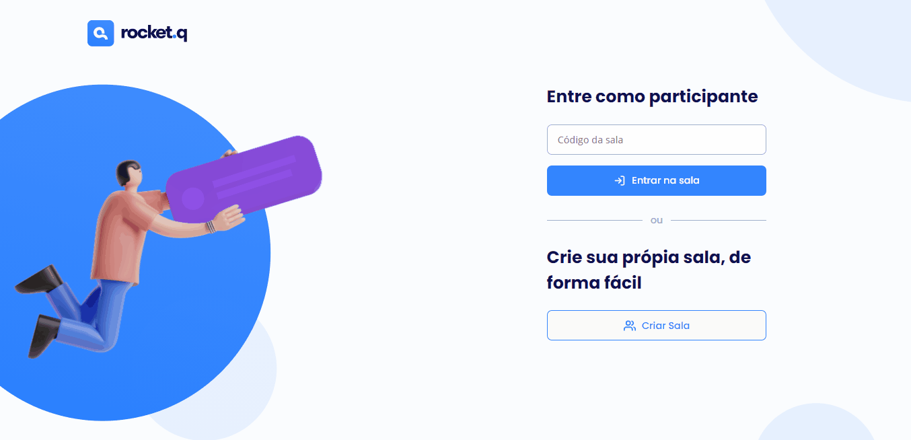

<h1 align="center">

</h1>
 

>## 💻Projeto

O Rocket.Q é uma central de perguntas anônimas. Nesta aplicação é possivel abrir salas para que os internautas possam interagir por meio de perguntas, e o criador das salas em posse de um senha pode gerenciar essas perguntas marcando como lidas ou excluindo.

 

>## 📸 Demonstração

 

>## 🚀 Tecnologias
* [HTML](https://developer.mozilla.org/pt-BR/docs/Web/HTML)
* [CSS](https://developer.mozilla.org/pt-BR/docs/Web/CSS)
* [JAVASCRIPT](https://developer.mozilla.org/pt-BR/docs/Web/JavaScript)
* [NODEJS](https://nodejs.org/en/)
* [EXPRESS](https://expressjs.com/pt-br/)
* [EJS](https://ejs.co/)
* [SQLITE](https://www.sqlite.org/index.html)
 

>## 📝 Licença

Esse projeto está sob a licença MIT.

---

Feito by 👋 Wend Carlos

